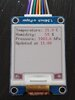
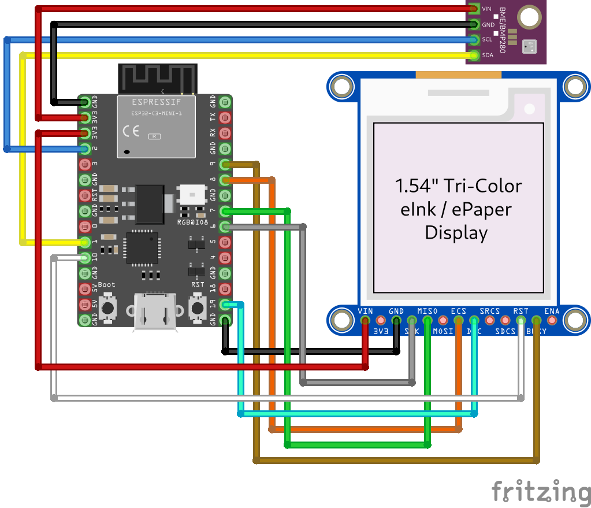

Crussant 🥐🦀
====

Rust async firmware for ESP32-C3 to read and display css811 and hdc1080 sensor
readings using Embassy. Too complicated but definitely yummy, just like a
croissant!


[](./display.jpg)


This [`no_std`] and no [`alloc`] firmware runs on a [ESP32-C3] microcontroller,
samples environment data (temperature, humidity) from a [HDC1080] sensor and
air quality data (eCO2, eTVOC) from a [CSS811] over I²C, and displays the latest
data on a [WaveShare 1.54 inches model B version 2] E-INK display over SPI.

It does all this asynchronous, using [Embassy][embassy] as an async framework.
All communication with the sensors and display over I²C and SPI are async using
the [`embedded-hal-async`][embedded-hal-async] HAL and the [`esp-hal`][esp-hal]
HAL implementation for esp32c3.


It is mostly meant as a reference / example / starting point. The Rust + ESP32 +
Embassy ecosystem is still very young, and I had a hard time putting everything
together to make a complete application. Hopefully this project will be useful
to other beginners :)

[ESP32-C3]: https://www.espressif.com/en/products/socs/esp32-c3
[HDC1080]: https://www.ti.com/lit/ds/symlink/hdc1080.pdf
[CSS811]: https://www.farnell.com/datasheets/3216221.pdf
[WaveShare 1.54 inches model B version 2]: https://www.waveshare.com/product/1.54inch-e-paper-module-b.htm
[embassy]: https://embassy.dev/
[embedded-hal-async]: https://crates.io/crates/embedded-hal-async
[esp-hal]: https://crates.io/crates/esp-hal
[T8-C3]: https://www.tinytronics.nl/en/development-boards/microcontroller-boards/with-wi-fi/lilygo-ttgo-t8-c3-esp32-c3-4mb-flash

Acknowledgements
----

This project builds on the example by Claudio Mattera. Thanks to Claudio Mattera
to provide inspiration and a reference point to fork for this project. Check out
his amazing [esp32c3-embassy repo].

In general this work heavily uses building blocks provided by others, such as
the amazing [embassy], [embedded-hal-async] and [esp-hal] frameworks.

Although I can't quite get it to work yet, thanks to Stefan Frijters for
packaging the esp32c3 capable qemu fork from Espressif.

[esp32c3-embassy repo]: https://github.com/claudiomattera/esp32c3-embassy

Architecture
----


The main entry point sets up the [Log] logger and jumps to a second stage which
configures the [esp-hal], [embassy] (using the general timer) and the Clock,
I2C, SPI and DMA drivers. Currently the clock is configured by injecting the
compilation time into the binary through an environment variable (see build.rs).

The programs consists of 3 [embassy] tasks. A blink task that blinks the green
LED on my [T8-C3] board for quick troubleshooting. A sensor tasks that
periodically samples the [HDC1080] and [CSS811] sensors over I2C, and a display
task that receives sensor samples from an embassy channel and displays them on
the [WaveShare 1.54 inches model B version 2] using SPI.

Pinout
----

For the CJMCU-8118 sensor package

* SDA -> GPIO2
* SCL -> GPIO4
* VIN/VCC -> 3.3v
* GND -> GND

For the SPI EPD display

* SCK/SCLK/CLK -> GPIO6
* DIN -> GPIO7 (MOSI)
* CS -> GPIO8
* BUSY -> GPIO9
* RST -> GPIO10
* DC -> GPIO19
* VIN/VCC -> 3.3v
* GND -> GND





How to build
----

First obtain the correct rust toolchain, either through cargo or the nix flake.

This repository includes a collection of build, running and other [Just] commands
useful to this project in `./justfile.` To view all possible commands:

```bash
just
```


How to run
----

To flash the firmware to an esp32c3 board, the [espflash] tool is used. It is
configured in `./cargo/config.toml`

To invoke it through cargo:

```bash
cargo run
```


Contributing
----

Contributions are always welcome, please check out the [Contributing Guide](./CONTRIBUTING.md).


License
----

You are free to copy, modify, and distribute this driver with attribution under
the terms of the MIT license (file [`LICENSE-MIT.txt`](./LICENSE-MIT.txt) or <https://opensource.org/licenses/MIT>)

